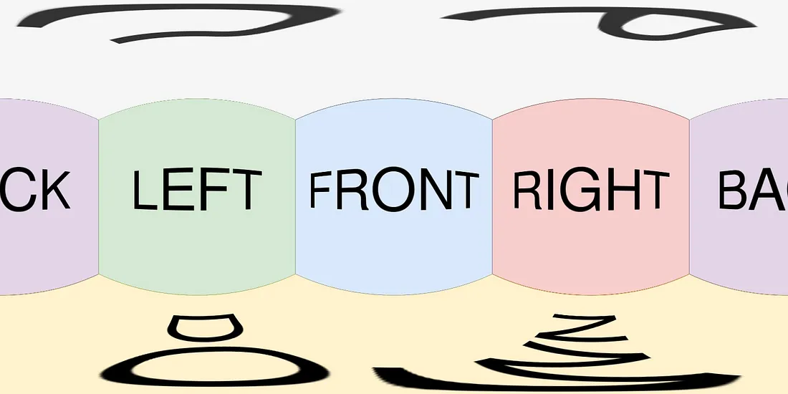
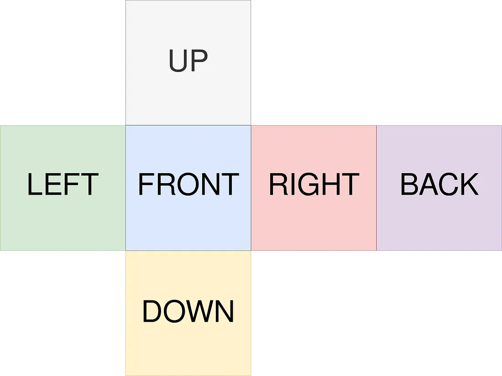
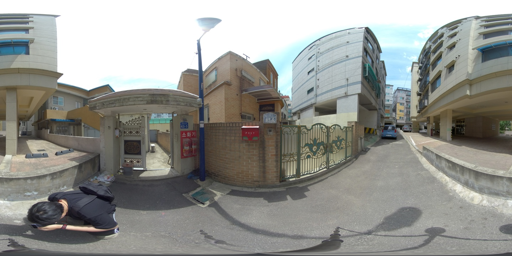
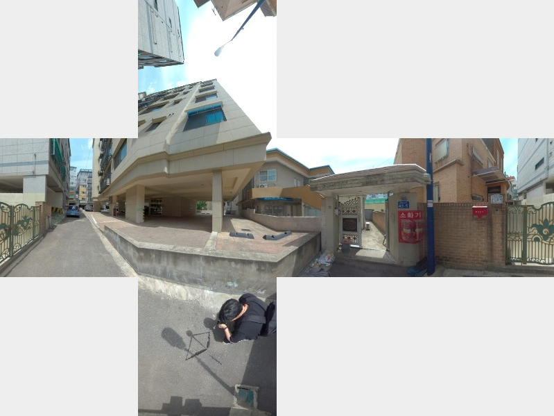
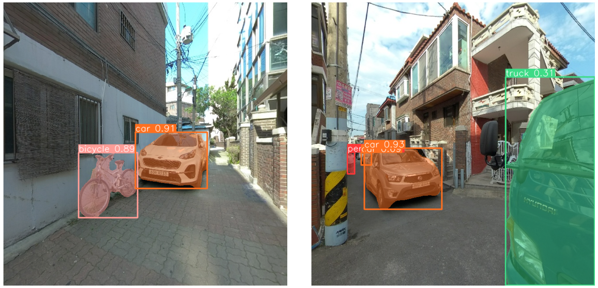
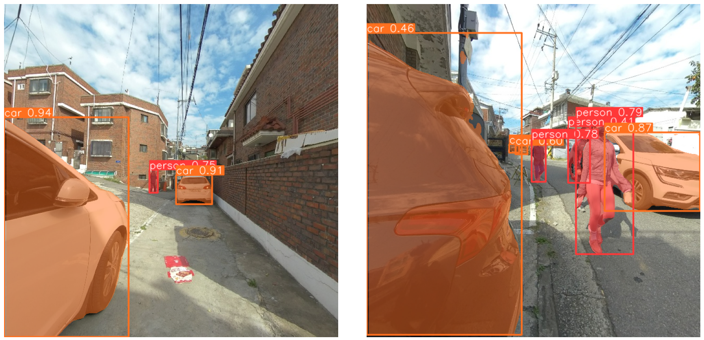

# YOLOv8 을 이용한 거리 이미지 분석

YOLOv8은 이미지 객체 감지(Object Detection), 인스턴스 분할(Instance Segmentation), 객체 추적(Object Tracking) 분야에서 YOLO 시리즈의 최신 버전으로, 가장 널리 사용되는 알고리즘이다. 이 레포지토리에선 YOLOv8 모델을 이용한 거리뷰 이미지 분석을 하고자 한다. YOLOv8 모델을 사용하기에 앞서 왜곡된 이미지를 보정해 인식 정확도를 올리는 전처리를 수행한다.

    

### 1. Spherical Image To Cubemap
----
파노라마 이미지의 왜곡을 보정하는 이미지 전처리 과정을 통해 인식률과 정밀도를 향상시킨다. 파노라마 이미지를 보정하면 상, 하, 좌, 우, 정면, 후면 총 6면으로 분할하게 되고 이를 YOLOv8 모델의 이미지 입력사이즈 640x640으로 조정한다(본 프로젝트에선 상, 하 두 면을 제외했다).

[노트북 cvt_cubemap.ipnb 참조](cvt_cubemap.ipynb)

**이미지 예시**

    
     

    
     

### 2. YOLOv8 Ultralytics: State-of-the-Art YOLO Models
---
골목길 거리뷰 이미지 분석에 있어, COCO(Common Objects in Context) 데이터셋으로 사전 학습된 모델(pre-trained model)을 활용했다. COCO 데이터셋의 80개 클래스 중에서 주로 생활도로와 관련 깊은 항목 위주로 따로 선별하여 측정했으며, 선별된 클래스는 사람, 자전거, 승용차, 이륜차, 버스, 트럭, 신호등, 소화선, 정지 표지판, 주차료 징수기, 벤치 총 11개이다.

[노트북 main.ipynb 참조](main.ipynb)

**이미지 예시**

    

    

### Reference
---
1. [YOLO v8 Ultralytics: State-of-the-Art YOLO Models](https://github.com/ultralytics/ultralytics)
2. [Video source from learnopencv](https://learnopencv.com/ultralytics-yolov8/)
3. [Spherical image to cubemap](https://jaxry.github.io/panorama-to-cubemap/)